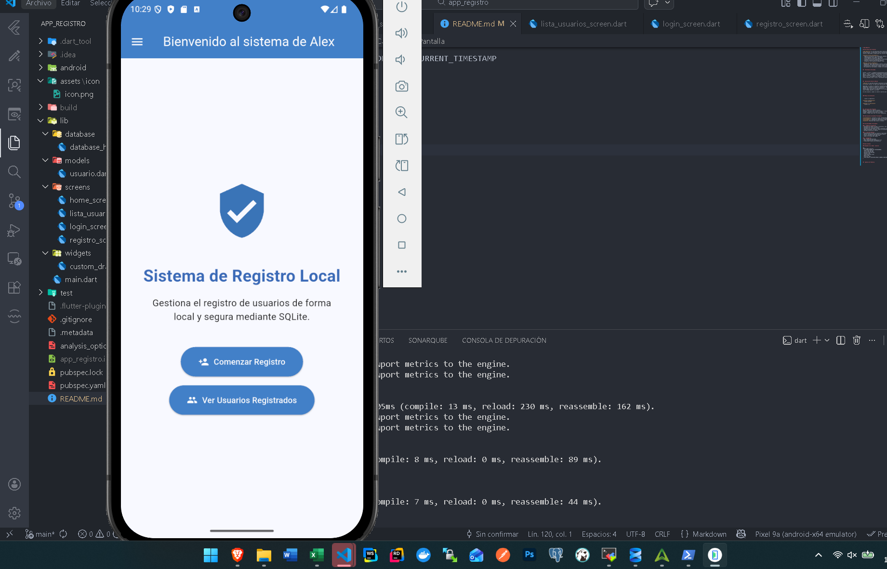
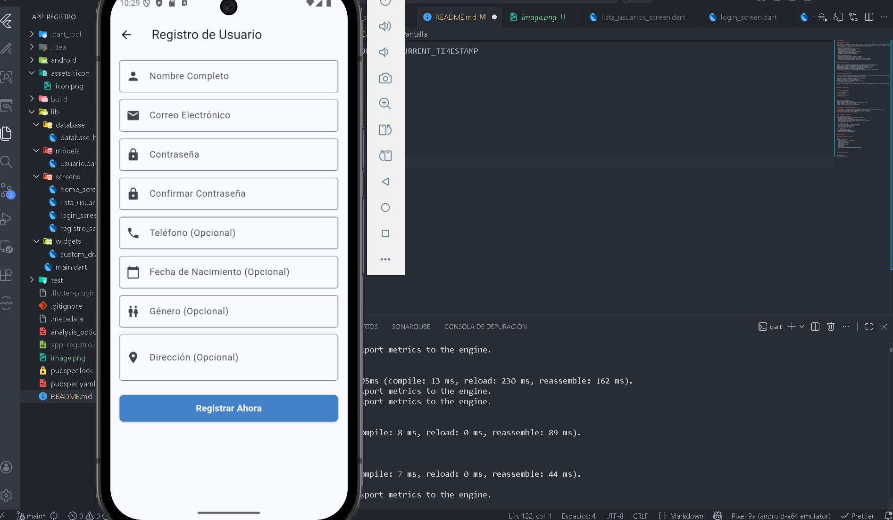
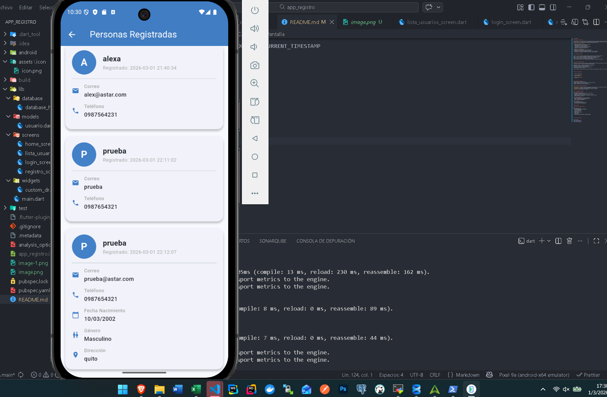
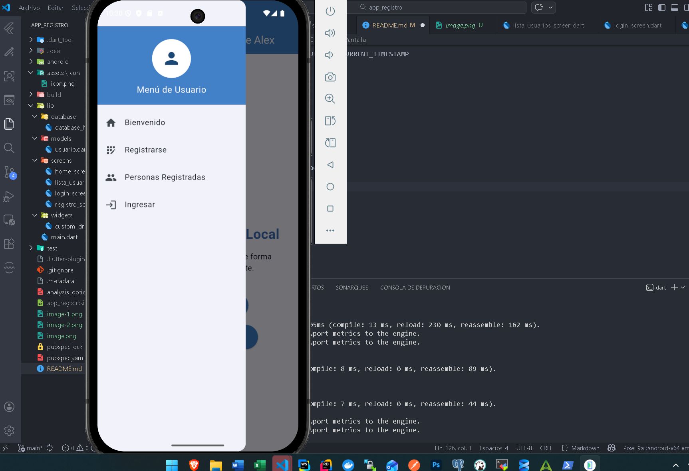
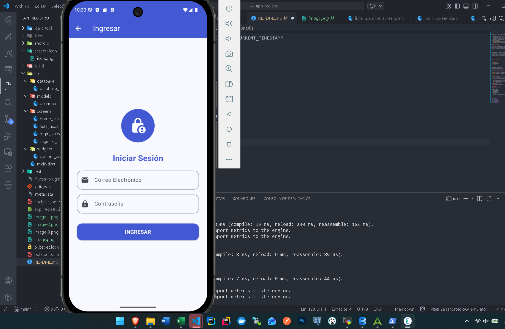
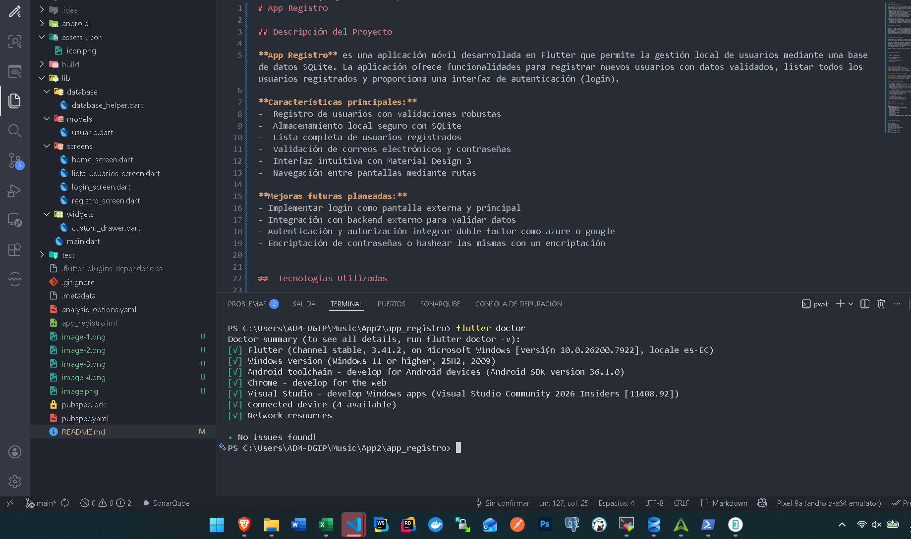

# App Registro

## Descripción del Proyecto

**App Registro** es una aplicación móvil desarrollada en Flutter que permite la gestión local de usuarios mediante una base de datos SQLite. La aplicación ofrece funcionalidades para registrar nuevos usuarios con datos validados, listar todos los usuarios registrados y proporciona una interfaz de autenticación (login).

**Características principales:**
-  Registro de usuarios con validaciones robustas
-  Almacenamiento local seguro con SQLite
-  Lista completa de usuarios registrados
-  Validación de correos electrónicos y contraseñas
-  Interfaz intuitiva con Material Design 3
-  Navegación entre pantallas mediante rutas

**Mejoras futuras planeadas:**
- Implementar login como pantalla externa y principal 
- Integración con backend externo para validar datos
- Autenticación y autorización integrar doble factor como azure o google
- Encriptación de contraseñas o hashear las mismas con un encriptación

##  Tecnologías Utilizadas

Flutter | 3.10.7+ | Framework multiplataforma para desarrollo de aplicaciones móviles |
Dart | 3.10.7+ | Lenguaje de programación optimizado para aplicaciones rápidas |
SQLite | (sqflite 2.4.2) | Base de datos relacional local y ligera |
Material Design 3 | Nativa | Sistema de diseño de Google para UI/UX moderno |
path | 1.9.1 | Utilidades para manipular rutas de archivos |
flutter_launcher_icons | 0.13.1 | Herramienta para personalizar iconos de la aplicación |

##  Explicación Breve de SQLite

**SQLite** es una base de datos relacional de código abierto que se ejecuta directamente en el dispositivo sin necesidad de un servidor externo. Es ideal para aplicaciones móviles porque:

Seguridad: Los datos se almacenan localmente en el dispositivo
Rendimiento: Consultas rápidas sin latencia de red
Ligera: Usa mínimos recursos del dispositivo
Portabilidad: Los datos se almacenan en un archivo único
Libre: Código abierto y sin costo

En este proyecto, usamos la librería sqflite para Flutter, que proporciona un acceso fácil y eficiente a SQLite desde Dart.

### Pasos de Instalación

   clonar el repositorio

**Instalar dependencias**
   flutter pub get

**Ejecutar la aplicación**
   flutter run

##  Estructura del Proyecto
models: mapeo de la tabla de usuario
database: instancia para la base de datos y creación de la tabla
screens: pantallas a usar para el sistema
widgets: sidebar para usar en varios componentes

### Descripción de Carpetas Principales

**lib/database/**: Contiene la clase `DatabaseHelper` que gestiona todas las operaciones con SQLite
**lib/screens/**: Contiene las pantallas principales de la aplicación
**lib/widgets/**: Componentes reutilizables como el drawer de navegación
**assets/**: Recursos como iconos y imágenes

## Funcionalidades Principales

### 1. Registro de Usuarios
- Validación de nombre (mínimo 3 caracteres, solo letras)
- Validación de correo electrónico
- Validación de contraseña (mínimo 6 caracteres con números)
- Campos opcionales: teléfono, fecha de nacimiento, género, dirección
- Guardado automático en SQLite

### 2. Lista de Usuarios
- Visualización de todos los usuarios registrados
- Mostrar información detallada de cada usuario
- Iconos indicadores para cada campo
- Avatar con inicial del nombre

### 3. Navegación
- Menú drawer personalizado
- Rutas nombradas para navegación fácil
- Transiciones suaves entre pantallas

## Base de Datos

### Esquema de la Tabla `usuarios`

sql
CREATE TABLE usuarios(
  id INTEGER PRIMARY KEY AUTOINCREMENT,
  nombre TEXT NOT NULL,
  correo TEXT NOT NULL,
  password TEXT NOT NULL,
  telefono TEXT,
  fecha_nacimiento TEXT,
  genero TEXT,
  direccion TEXT,
  fecha_registro DATETIME DEFAULT CURRENT_TIMESTAMP
)

##  Capturas de Pantalla

menu principal

pantalla para registros

prueba de usuarios registrados

sidebar

login

flutter estable
